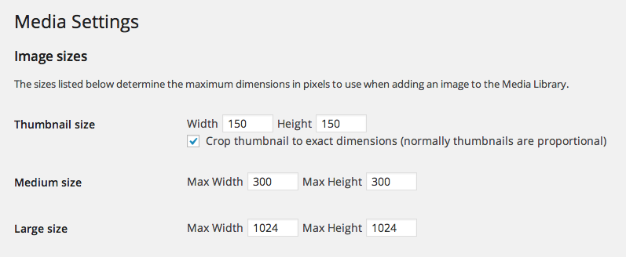

When working with [WordPress](http://wordpress.org/), there are times that we need to include images at sizes that do not come out of the box with the platform. The ones that come with it, although standard, sometimes are either too big or not big enough. This article is going to focus on how to add (or register) image sizes using WordPress's included functions documented in the [Codex](htps://developer.wordpress.org).

When a user uploads an image into the Media Library, WordPress resizes images to three varying sizes: `thumbnail`, `medium`, `large` and keeps the original size called full. The sizes dimensions can be changed in the Settings section of the admin panel.



These sizes can be changed, but won't apply to older images that have been saved in the Media Library. So think about the sizes you're going to be using throughout the site before creating your theme. This will make it so that images that are added after your theme is activated will be resized/cropped after being uploaded.

### Edit your theme's `functions.php` file

In your theme's `functions.php` file, we're going to add all of the required function calls to add new image sizes. Here are the functions we're going to cover (if you want to do some light reading after this one).

- [add_action()](https://developer.wordpress.org/reference/functions/add_action/)
- [add_theme_support()](https://developer.wordpress.org/reference/functions/add_theme_support/)
- [add_image_size()](https://developer.wordpress.org/reference/functions/add_image_size/)

#### Code

Here's the completed code. You can copy this and throw it right in your `functions.php` theme file.

```php
add_action('after_theme_setup', function() {
  add_theme_support('post-thumbnails');
  add_image_size('blog-preview-featured', 656, 298, true);
  add_image_size('blog-preview-small', 410, 230, true);
  add_image_size('blog-main', 855, 575);
});
```

#### Let's break it down

Looking at the above, its not that scary. You can see that we first create a closure that adds functionality and theme support to our WordPress theme. The [hook](https://codex.wordpress.org/Plugin_API#Hooks.2C_Actions_and_Filters) use is `after_theme_setup`.

```php
add_action('after_theme_setup', function() {
  //
});
```

 Here is the main function callback that willhook into your theme. This fires right after you hit the activate button on your theme settings page as well as every time WordPress loads the theme at runtime. Right after this, we have to make sure that our theme supports thumbnails (or featured images).

 ```php
add_theme_support('post-thumbnails`); 
```

This seems pretty straight forward right? [Learn more about Post Thumbnails](https://codex.wordpress.org/Post_Thumbnails). Next we're going to use the `add_image_size()` function to register each custom size we want to use within our theme.

In the above examples, you can see how each is used.

```php
add_image_size('blog-preview-featured', 656, 298, true); 
```

Essentially, we tell WordPress the new size's name and what its dimensions will be. The fourth argument asks if we want to force crop the image to that size. By default, it's set to `false`. Its set it to true in two of the examples above. This can also take an `array` as the value. The array is the position of the crop: `array('top', 'left')`.

Check out the documentation on the [WordPress Codex](https://developer.wordpress.org/reference/functions/add_image_size/).

### How to use it in your theme.

Now that you have the image sizes registered, you can use them throughout your code with `the_post_thumbnail()` ([codex](https://developer.wordpress.org/reference/functions/the_post_thumbnail/)). Some functions that work with images, may also take a size argument. Because these sizes are registered throughout the WordPress instance globally, they will be available to those functions as well. For example, you can use get_`the_post_thumbnail()`, `the_post_thumbnail()` or `wp_get_attachment_image_src()`.

Most of the time, you will find yourself using it like so:

```php
// Large 
the_post_thumbnail('large');

// Featured
the_post_thumbnail('blog-preview-featured');
```